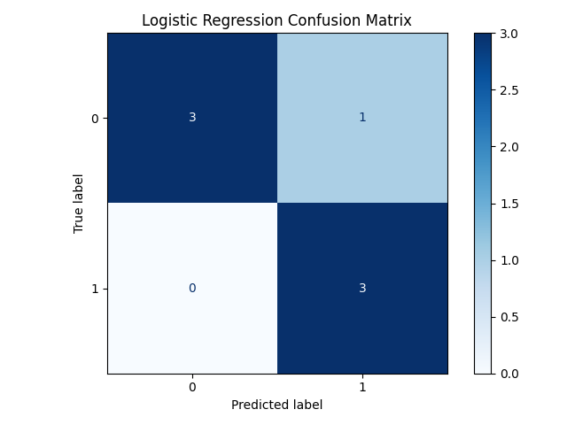
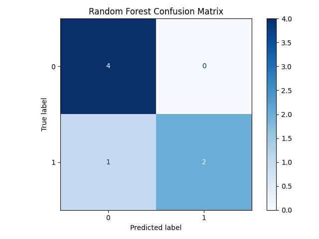
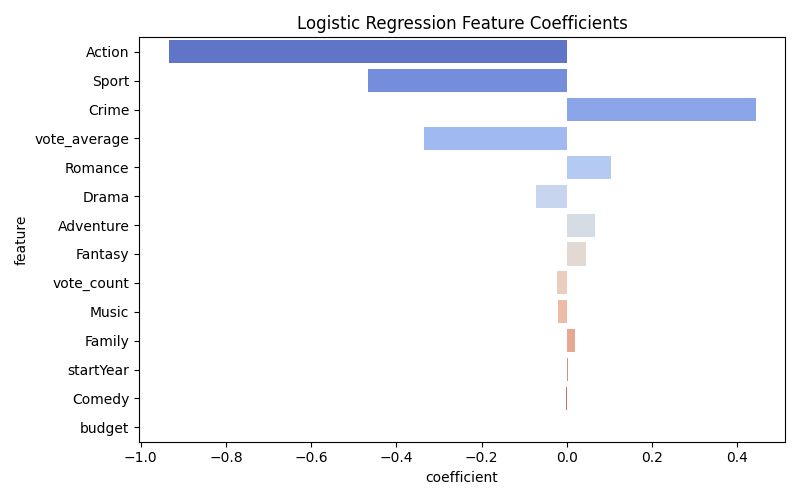
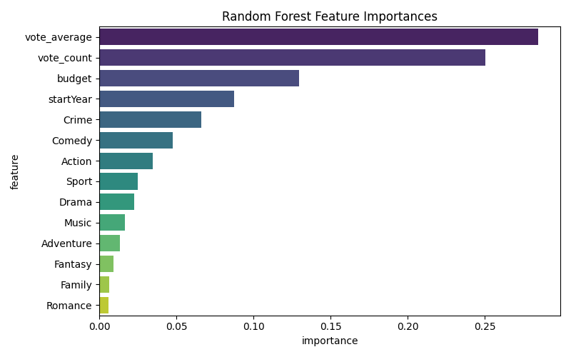
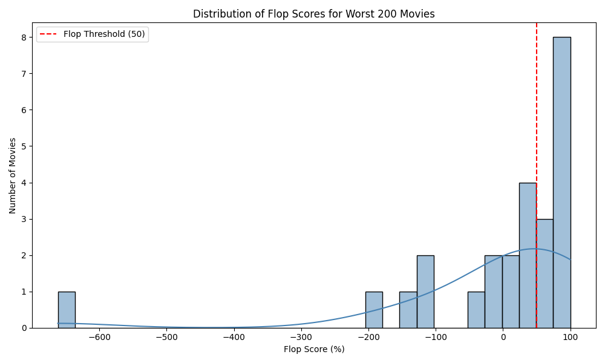

# IMDb Flop Score

This project enriches a dataset of IMDb's lowest-rated 200 movies by fetching financial and popularity data from The Movie Database (TMDb) API.  
The goal is to define a custom **Flop Score** that combines box office loss and poor audience reception to highlight the biggest cinematic failures.

## 🔍 What this project does

- Loads IMDb's 200 lowest-rated films
- Gathers movie data (budget, revenue, ratings) from the TMDb API
- Prepares for analysis and visualization of the worst-performing movies
- (Coming soon) Calculates a custom Flop Score and explores key insights

## 🧠 Skills Demonstrated

- Python data pipelines
- API access and enrichment
- Handling missing/imperfect real-world data
- Preparing for custom metric development and EDA

## 📉 Visuals

### 💣 Top 10 Worst Flops (by Flop Score)

## Key Visualizations

### Confusion Matrices

These confusion matrices display model prediction performance, showing true positives (bottom-right), false positives (top-right), true negatives (top-left), and false negatives (bottom-left).

| Logistic Regression | Random Forest |
|:-------------------:|:-------------:|
|  |  |

---

### Feature Importances

The bar charts below highlight the most influential features for each model, revealing what factors contribute most to predicting a movie flop.

| Logistic Regression Coefficients | Random Forest Feature Importance |
|:-------------------------------:|:-------------------------------:|
|  |  |

---

### Flop Score Distribution

The distribution of flop scores illustrates how the dataset separates flops from non-flops, guiding the threshold selection.

---

